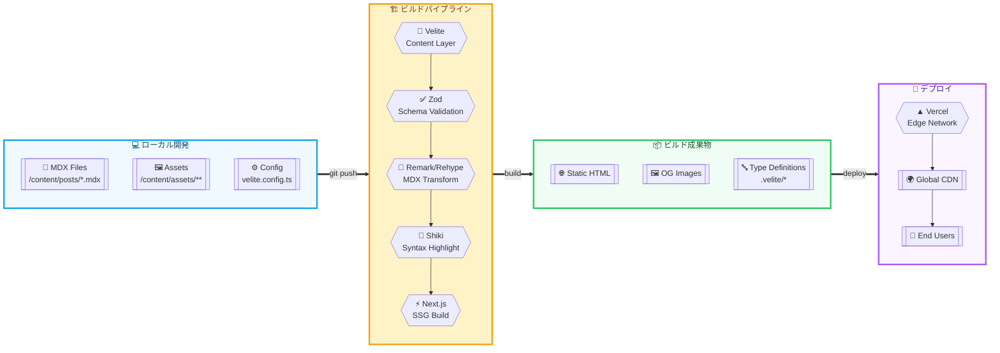

# 独自ブログアプリ 技術設計ドキュメント（v1.0）

最終更新: 2025-09-27 / タイムゾーン: Asia/Tokyo

---

## 0. ゴール / 非ゴール

**ゴール**

* pnpm / Next.js（App Router）/ Tailwind CSS + shadcn/ui / MDX による **型安全** かつ **シンプル運用**のブログ基盤を構築する。
* 記事は **リポジトリ内で管理**（Git 管理）し、**Vercel** にデプロイ。
* モダンな選択肢として **Velite + Zod** をコンテンツ層に採用。MDX は remark/rehype で拡張。
* SEO は **Next.js Metadata API** を中核に **最低限**を整備（sitemap/robots/JSON-LD/OGP）。

**非ゴール（今回考慮しない）**

* 検索機能、i18n、オーサリング支援、法務/運用、任意拡張（PWA/Newsletter 等）
* 記事増加時のビルド時間最適化（今回は考慮しない）

---

## 1. 全体アーキテクチャ概要



---

## 2. 技術スタック一覧

* **パッケージ管理**: pnpm
* **フレームワーク**: Next.js（App Router）
* **UI**: Tailwind CSS, shadcn/ui, @tailwindcss/typography
* **コンテンツ層/型安全**: **Velite + Zod**（MDX frontmatter のスキーマ化 + 型生成）
* **MDX 拡張**: remark-gfm / rehype-slug / rehype-autolink-headings / rehype-pretty-code(Shiki)
* **画像/メディア**: next/image 自動適用（rehypeで `` を置換）、画像はリポジトリに保存、OGP は next/og（Satori）で自動生成
* **SEO/配信（最低限）**: Next Metadata API / `app/sitemap.ts` / `app/robots.ts` / JSON-LD（Article）
* **品質保証/CI**: Biome（fmt/lint）/ remark-lint / Playwright（最小E2E）/ GitHub Actions（必要最低限）

---

## 3. コンテンツ層 / 型安全

### 3.1 設計方針

* **Velite** を採用し、`content/posts/**/*.mdx` を **コレクション**として定義。
* **Zod** で frontmatter スキーマを厳格化（タイトル/説明/公開日/タグ/ドラフト等）。
* ビルド時に `.velite/` へ **型付きインデックス** と（必要に応じて）**コンパイル済み MDXコード**を出力。
* スラッグはファイル名基準（`content/posts/2025-01-02-hello.mdx` → `/blog/2025-01-02-hello`）。

### 3.2 frontmatter スキーマ（例）

```ts
// velite.schema.ts（概略）
import { z } from 'zod';

export const PostSchema = z.object({
  title: z.string().min(1),
  description: z.string().max(160),
  date: z.coerce.date(),         // 公開日
  updated: z.coerce.date().optional(),
  tags: z.array(z.string()).default([]),
  draft: z.boolean().default(false),
  cover: z.string().optional(),  // OGP 用メイン画像（任意）
});
export type Post = z.infer<typeof PostSchema> & {
  slug: string;
};
```

### 3.3 Velite コレクション定義（概略）

> **注**: Velite の API 名はバージョンにより異なることがあります。下記は概念設計です。

```ts
// velite.config.ts（概略）
import { defineConfig, defineCollection, s } from 'velite';
import { PostSchema } from './velite.schema';

const posts = defineCollection({
  name: 'posts',
  pattern: 'content/posts/**/*.mdx',
  schema: s.zod(PostSchema),
  // 例: コンピューテッドフィールドで slug を付与
  transform: (doc) => ({
    ...doc,
    slug: doc._meta.path
      .replace(/^content\/posts\//, '')
      .replace(/\.mdx$/, ''),
  }),
});

export default defineConfig({
  collections: { posts },
  outDir: '.velite',
});
```

### 3.4 記事配置と命名規則

* ディレクトリ構成:
  - 単体記事: `content/posts/YYYY-MM-DD-title.mdx`
  - 画像付き記事: `content/posts/article-name/index.mdx` + 同フォルダ内に画像配置
* ファイル名: `YYYY-MM-DD-title.mdx` または `index.mdx`（フォルダ型の場合）
* スラッグ: ファイル名/フォルダ名から拡張子を除いた文字列
* ドラフト: `draft: true` を付与し、一覧/サイトマップから除外

---

## 4. MDX 拡張

### 4.1 目標

* 読みやすい見出しリンク、表や脚注などの GFM、ハイライトが綺麗なコードブロック。
* MDX 内の `` を `next/image` に統一（サイズ最適化・LazyLoad）。

### 4.2 プラグイン構成（概略）

```ts
// mdxPlugins.ts（概略）
import remarkGfm from 'remark-gfm';
import rehypeSlug from 'rehype-slug';
import rehypeAutolinkHeadings from 'rehype-autolink-headings';
import rehypePrettyCode from 'rehype-pretty-code';

export const remarkPlugins = [remarkGfm];
export const rehypePlugins = [
  rehypeSlug,
  [rehypeAutolinkHeadings, { behavior: 'wrap' }],
  [rehypePrettyCode, {
    // Shiki を内部利用。テーマ/ラインハイライト等はここで調整
    keepBackground: false,
  }],
  // カスタム:  → <Image /> 置換（概略）
  function rehypeNextImage() {/* impl */},
];
```

### 4.3 Next.js への組み込み（概略）

```ts
// next.config.mjs（概略）
import createMDX from '@next/mdx';
import { remarkPlugins, rehypePlugins } from './mdxPlugins.js';

const withMDX = createMDX({ options: { remarkPlugins, rehypePlugins } });

/**** export ****/
export default withMDX({
  pageExtensions: ['ts', 'tsx', 'md', 'mdx'],
  experimental: { mdxRs: true },
});
```

### 4.4 コードハイライト方針

* **rehype-pretty-code + Shiki** を採用。行番号/ラインハイライト/差分表現も対応。
* ダーク/ライトに合わせたテーマ切替は CSS 変数で吸収。

---

## 5. SEO / 配信（最低限）

### 5.1 Metadata API の採用

* 既定メタは `app/layout.tsx` の `export const metadata` で宣言。
* 記事ページは `generateMetadata()` で frontmatter（Velite）から **title/description/date/OG/Twitter** を動的生成。
* `metadataBase` を `.env` の `NEXT_PUBLIC_SITE_URL` から構築。

```ts
// app/blog/[slug]/page.tsx（概略）
import type { Metadata } from 'next';
import { getPostBySlug } from '@/lib/posts';

export async function generateMetadata({ params }): Promise<Metadata> {
  const post = await getPostBySlug(params.slug);
  const url = new URL(`/blog/${post.slug}`, process.env.NEXT_PUBLIC_SITE_URL);
  return {
    title: post.title,
    description: post.description,
    alternates: { canonical: url },
    openGraph: {
      type: 'article',
      url,
      title: post.title,
      description: post.description,
      images: [{ url: `/og/${post.slug}` }],
    },
    twitter: { card: 'summary_large_image' },
  };
}
```

### 5.2 sitemap / robots

```ts
// app/sitemap.ts（最小）
import { MetadataRoute } from 'next';
import { allPosts } from '.velite/posts'; // 概略: Velite 出力

export default function sitemap(): MetadataRoute.Sitemap {
  const base = process.env.NEXT_PUBLIC_SITE_URL!;
  return [
    { url: base, priority: 1.0 },
    ...allPosts
      .filter((p) => !p.draft)
      .map((p) => ({ url: `${base}/blog/${p.slug}`, changeFrequency: 'weekly' })),
  ];
}

// app/robots.ts（最小）
import { MetadataRoute } from 'next';
export default function robots(): MetadataRoute.Robots {
  const base = process.env.NEXT_PUBLIC_SITE_URL!;
  return {
    rules: [{ userAgent: '*', allow: '/' }],
    sitemap: `${base}/sitemap.xml`,
  };
}
```

### 5.3 構造化データ（JSON-LD）

```tsx
// app/blog/[slug]/_components/ArticleJsonLd.tsx（最小）
export function ArticleJsonLd({ post }: { post: { title: string; description: string; slug: string; date: string; } }) {
  const base = process.env.NEXT_PUBLIC_SITE_URL!;
  const json = {
    '@context': 'https://schema.org',
    '@type': 'Article',
    headline: post.title,
    description: post.description,
    datePublished: post.date,
    url: `${base}/blog/${post.slug}`,
  };
  return (
    <script type="application/ld+json" dangerouslySetInnerHTML={{ __html: JSON.stringify(json) }} />
  );
}
```

### 5.4 サイト設定の一元管理

```ts
// lib/site-config.ts（サイト全体で共通利用する設定）
export const siteConfig = {
  name: 'My Blog',
  description: 'A modern blog built with Next.js and MDX',
  url: process.env.NEXT_PUBLIC_SITE_URL || 'http://localhost:3000',
  author: {
    name: 'Author Name',
    email: 'author@example.com',
    url: 'https://example.com',
  },
  social: {
    twitter: '@handle',
    github: 'username',
  },
  locale: 'ja-JP',
  timezone: 'Asia/Tokyo',
} as const;

export type SiteConfig = typeof siteConfig;
```

---

## 6. 画像・メディア運用（採用済み方針）

* **MDX内画像の自動最適化**: Velite の `copyLinkedFiles: true` で相対パス画像を自動処理。
* **保存先**:
  - 記事専用画像: 記事と同フォルダ（`content/posts/article-name/image.jpg`）
  - MDX内で相対パス参照（`./image.jpg`）
  - ビルド時に `/public/static/` へハッシュ付きでコピー（Velite が自動処理）
* **Git管理**: `content/` 内の画像のみ管理。`/public/static/` は `.gitignore` に追加（自動生成のため）。
* **OGP自動生成**: `next/og`（Satori）で記事ごとの OGP を動的生成。

```tsx
// app/og/[slug]/opengraph-image.tsx（概略）
import { ImageResponse } from 'next/og';
import { getPostBySlug } from '@/lib/posts';
export const size = { width: 1200, height: 630 };
export const contentType = 'image/png';

export default async function Image({ params }: { params: { slug: string } }) {
  const post = await getPostBySlug(params.slug);
  return new ImageResponse(
    (
      <div style={{ fontSize: 64, width: '100%', height: '100%', display: 'flex', alignItems: 'center', justifyContent: 'center' }}>
        {post.title}
      </div>
    ),
    { ...size }
  );
}
```

---

## 7. ルーティング & 生成方式（App Router）

### 7.1 方針

* **基本は SSG（静的サイト生成）**。記事は Git 管理され、デプロイで反映。
* ISR は **原則不要**（リポジトリ直管理のため）。

### 7.2 ルーティング例

```
/app
  /(site)
    /page.tsx           # トップ
  /(blog)
    /page.tsx           # 一覧
    /[slug]/page.tsx    # 記事詳細
  /sitemap.ts           # サイトマップ
  /robots.ts            # robots
  /og/[slug]/opengraph-image.tsx  # OGP
```

### 7.3 SSG 実装（概略）

```ts
// app/(blog)/[slug]/page.tsx（概略）
import { allPosts } from '.velite/posts';
import { MDXRenderer } from '@/components/MDXRenderer'; // useMDXComponent的なラッパ

export async function generateStaticParams() {
  return allPosts.filter(p => !p.draft).map((p) => ({ slug: p.slug }));
}

export default async function Page({ params }) {
  const post = allPosts.find((p) => p.slug === params.slug)!;
  return <MDXRenderer code={post.code} components={{}} />; // code は Velite 出力を想定
}
```

---

## 8. ディレクトリ構成（推奨）

```
root
├─ app
│  ├─ (site)/page.tsx
│  ├─ (blog)/page.tsx
│  ├─ (blog)/[slug]/page.tsx
│  ├─ sitemap.ts
│  ├─ robots.ts
│  └─ og/[slug]/opengraph-image.tsx
├─ components
│  ├─ ui/*               # shadcn/ui のラップ
│  └─ MDXRenderer.tsx    # useMDXComponent ラッパ
├─ content
│  └─ posts/
│      ├─ YYYY-MM-DD-title.mdx    # 単体記事
│      └─ article-name/            # 画像付き記事
│          ├─ index.mdx
│          └─ *.{jpg,png,svg}
├─ styles/*
├─ lib
│  ├─ posts.ts           # Velite の薄いヘルパ
│  ├─ site-config.ts     # サイト全体の設定
│  └─ seo.ts             # 共通メタ/JSON-LD
├─ .velite/*             # ビルド成果物（出力先）
├─ mdxPlugins.ts
├─ velite.schema.ts
├─ velite.config.ts
├─ next.config.mjs
├─ biome.json            # Biome 設定
├─ .remarkrc.cjs         # remark-lint 設定
├─ playwright.config.ts
└─ .github/workflows/ci.yml
```

---

## 9. UI/スタイル指針

* **Tailwind + shadcn/ui** を基盤に、タイポグラフィは `@tailwindcss/typography` を使用。
* ダークモードは `class` 戦略（`<html class="dark">`）で切替、コードブロック配色は CSS 変数で吸収。
* 記事本文は `.prose` クラスを基本に、MDX のカスタムコンポーネントで動画/告知カード等を拡張可能。

---

## 10. 品質保証 / CI（必要最低限）

### 10.1 Biome（lint/format, TypeScript-aware）

```json
// biome.json（最小）
{
  "$schema": "https://biomejs.dev/schemas/1.7.0/schema.json",
  "formatter": { "enabled": true },
  "linter": { "enabled": true },
  "javascript": { "formatter": { "semicolons": "asNeeded" } }
}
```

### 10.2 remark-lint（MDX/Markdown 品質）

```js
// .remarkrc.cjs（例）
module.exports = {
  plugins: {
    'remark-preset-lint-recommended': true,
    'remark-lint-no-dead-urls': true,
  },
};
```

### 10.3 Playwright（最小 E2E）

```ts
// tests/smoke.spec.ts
import { test, expect } from '@playwright/test';

test('トップが表示される', async ({ page }) => {
  await page.goto('/');
  await expect(page.locator('h1')).toBeVisible();
});

test('記事一覧→記事詳細', async ({ page }) => {
  await page.goto('/blog');
  const first = page.locator('a[href^="/blog/"]').first();
  await first.click();
  await expect(page.locator('article')).toBeVisible();
});
```

### 10.4 GitHub Actions（必要最低限）

```yaml
# .github/workflows/ci.yml
name: CI
on: [push, pull_request]
jobs:
  build:
    runs-on: ubuntu-latest
    steps:
      - uses: actions/checkout@v4
      - uses: pnpm/action-setup@v4
        with: { version: 9 }
      - uses: actions/setup-node@v4
        with:
          node-version: 20
          cache: 'pnpm'
      - run: pnpm install --frozen-lockfile
      - run: pnpm biome check .
      - run: pnpm build
      - name: Playwright
        run: |
          pnpm exec playwright install --with-deps
          pnpm exec playwright test --reporter=dot
```

---

## 11. 環境変数（最小）

* `NEXT_PUBLIC_SITE_URL`: 例 `https://example.com`
* （必要に応じて）`OG_DEFAULT_TITLE`, `OG_DEFAULT_SUBTITLE` など

---

## 12. 運用ルール

* 記事は PR で追加（レビューフローに lint チェックを含む）。
* `draft: true` は公開前に必ず `false` に変更。公開後の微修正は `updated:` を更新。
* 画像は `content/assets/` に配置。横幅 1200px 以上を推奨（OGP 兼用）。

---

## 13. 既知のリスク/留意点

* **ビルド時間**: 記事が極端に増えるとビルド時間が増加（今回は最適化を考慮しない方針）。
* **Velite の API 変化**: 新しめのエコシステムのため、マイナーアップデートで設定が変わる可能性。バージョンピン推奨。
* **OGP フォント**: `next/og` でカスタムフォントを使う場合は `fetch()` 埋め込みや `fs.readFile` の取り扱いに注意。

---

## 14. 導入チェックリスト（実行順）

1. pnpm / Node v20+ 準備
2. Next.js プロジェクト作成（App Router）
3. Tailwind & shadcn/ui セットアップ、typography プラグイン追加
4. Velite + Zod 導入、スキーマ/コレクション定義
5. MDX プラグイン（remark/rehype）導入、`@next/mdx` 組み込み
6. `next/image` 置換 rehype 実装
7. ルーティング（/blog, /blog/[slug]）& SSG 実装
8. Metadata API（`generateMetadata`）/ JSON-LD / sitemap / robots 実装
9. OGP 自動生成ルート実装（`/og/[slug]`）
10. Biome / remark-lint / Playwright / GitHub Actions 設定
11. Vercel へ接続・環境変数設定・デプロイ

---

## 付録 A: 依存パッケージ（例）

```sh
pnpm add next react react-dom tailwindcss @tailwindcss/typography class-variance-authority
pnpm add -D typescript @types/node @types/react @types/react-dom
pnpm add -D @next/mdx remark-gfm rehype-slug rehype-autolink-headings rehype-pretty-code
pnpm add -D velite zod biome remark-lint @playwright/test
```

## 付録 B: よくある拡張ポイント（任意）

* 記事内ショートコード（Callout、コードサンドボックス、YouTube 埋め込み）
* タグ/カテゴリページ、関連記事、パンくず
* Draft のプレビュー公開（Preview デプロイで `X-Robots-Tag: noindex` 付与）
